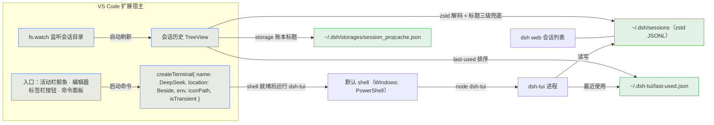

<!-- BEAUTIFIED -->
<h1 align="center">dsh-tui-vscode</h1>

<p align="center">
  <strong>dsh-TUI 的 VS Code companion 扩展——体验与 Claude Code 官方 VS Code 扩展几乎一致</strong>
  <br />
  <em>真实集成终端承载 · 编辑器区另一侧打开 · 多会话并存 · 侧边栏会话历史 · 指定会话恢复</em>
</p>

<p align="center">
  <a href="#快速开始"></a>
  <a href="LICENSE"></a>
</p>

<p align="center">
  
  
  
  
</p>

<p align="center">
  <a href="README_EN.md">English</a>
</p>

---

# dsh-tui-vscode

**dsh-tui-vscode** 让 [`dsh-tui`](https://github.com/ccch1mneyyy/dsh-TUI) 跑在 VS Code **真实的集成终端**里（编辑器区另一侧新开一列，Windows 默认 PowerShell）——**与 Claude Code 官方 VS Code 扩展的终端模式同构**（`createTerminal` + 在终端内运行 CLI），没有 webview、没有 xterm 模拟层。

## 展示

点击鲸鱼按钮后，**DeepSeek** 终端在编辑器区另一侧打开并自动运行 dsh-tui——真实终端、真实 shell、完整 TUI：

<p align="center">
  
</p>

## 特性

- **真实终端，非模拟**：会话运行在 VS Code 集成终端（你的默认 shell），拥有终端的一切原生能力：shell 集成、原生 Ctrl+C、复制粘贴、字体主题跟随。
- **打开位置 = 另一侧（默认）**：`ViewColumn.Beside`——在编辑器区**旁边新开一列**，绝不占你正在看的列（同 Claude Code）；`dsh-tui-vscode.terminalLocation` 可改为复用当前列（`active`）或开在底部面板（`panel`）。
- **多会话并存**：每次点击「启动新会话」都新开一个终端 + 会话，旧会话继续运行（同 Claude Code）。
- **侧边栏会话历史**：只展示**当前 VS Code 工作区**下的会话（含工作区子目录里启动的会话；多根工作区取并集；未打开工作区时为空列表），隐藏只有启动记录、没有任何对话的空会话、子代理派遣运行与**已归档会话**（与 dsh web 列表同源：读 `storages/workspace.json` 的归档集合）——与 dsh 浏览器默认视图一致；标题 + 紧凑相对时间（与 Web 会话列表同源），点击条目**恢复该指定会话**；条目悬停可**归档**（dsh 原生归档：日志保留、可随时恢复）与**重命名**，右键菜单可**永久删除**（危险操作，默认从右键进入）；「管理已归档会话」命令可恢复或彻底删除；目录变化自动刷新。
- **一键启动/恢复**：`Start new session`、`Resume last session`、侧边栏指定会话恢复——恢复指定会话走 `DSH_TUI_RESUME_SESSION` 环境变量通道（profile 的 `cordis.patch.yml` 启动时读取），与 `--resume` 互不干扰。
- **自动启停 + 环境注入**：打开 = 启动，关闭终端 = 进程结束；`$VISUAL` / `DSH_TUI_LANG` / `$DSH_HOME` 自动注入终端环境。

## 快速开始

前置条件：全局安装 DSH CLI 与 dsh-tui（首次启动自动初始化 profile，需 pnpm），运行模型需要 `DEEPSEEK_API_KEY`：

```sh
npm install -g @deepseek-ai/dsh @deepseek-harness-tui/dsh-tui
```

从 **VS Code 扩展面板**安装（推荐）：`Ctrl+Shift+X` 搜索 **`dsh-tui`** 一键安装；或从源码构建：

```sh
git clone https://github.com/baobaolaodie/dsh-tui-vscode.git
cd dsh-tui-vscode
npm install
npm run install:local
```

## 使用

- **启动 / 多开**：点**编辑器标签栏右侧鲸鱼按钮**，或命令 `dsh-tui: Start new session / 启动新会话`——每次都在编辑器区另一侧新开一个 **DeepSeek** 终端并自动运行 dsh-tui；再次点击 = 再开一个，多会话并行。**活动栏鲸鱼图标**打开侧边栏「会话历史」（欢迎页含启动/恢复按钮）。
- **恢复上次会话**：`dsh-tui: Resume last session / 恢复上次会话`（`--resume`，读 `~/.dsh-tui/resume.txt`）。
- **恢复指定会话**：侧边栏「会话历史」展开项目 → 点击会话条目——新终端携带 `DSH_TUI_RESUME_SESSION=<id>` 环境变量启动该会话。
- **终止**：关闭终端标签（只结束该会话），或在 TUI 内双击 `Ctrl+C`；命令 `dsh-tui: Terminate session / 终止会话` 向最近终端发送 Ctrl+C。
- **引用选中代码**：编辑器聚焦时按 `Ctrl+Alt+K`（macOS `Cmd+Alt+K`），或命令面板/编辑器右键「插入 @文件引用」——把当前文件或选中代码以 **`@相对路径#L起-止`** 形式插入运行中的 dsh-tui 输入框（相对路径以工作区根为基准；单行 `#L12`、多行 `#L12-14`、未选中仅 `@相对路径` 引用整个文件；dsh-TUI 提交消息时原生按行区间切片附加内容，不再整文件灌入）。无运行会话时回退为复制到剪贴板。
  > ⚠️ **版本门槛**：`#L` 行区间语法需 **dsh-TUI ≥ 含 #537（上游已合入）的版本**；`@` 引用可兼容无行区间的普通相对路径。搭配更旧的 dsh-TUI 时新语法会提示文件未找到，请先升级 dsh-TUI。
  - **快捷键冲突**：默认键 `Ctrl+Alt+K`（macOS `Cmd+Alt+K`）可能与 opencode 等扩展撞键（官方终端模式同样默认此键）。若无效或冲突，在「键盘快捷方式」（`Ctrl+K Ctrl+S`）搜索 `dsh_tui` 重绑为你习惯的键位即可；右键/命令面板入口不受影响。
- **选区自动上下文（默认开）**：`autoInsertMention` 开启后，编辑器选中代码经**IDE 选区通道**实时推送给运行中的 dsh-tui（300ms 防抖、推送坐标与编辑器选区文本，不占输入框），提问时自动附加选中内容并在 transcript 显示「⧉ Selected N lines from …」指示行；通道不可用时回退为键入 `@相对路径#L…`。需 dsh-TUI ≥ 含 IDE 选区通道（上游合并 #562 后）的版本。

## 架构



要点：

- **会话 = 真实终端**：扩展只负责 `createTerminal` 与发送启动命令，进程、信号、滚动、复制粘贴全部由 VS Code 终端承载（与官方扩展同一架构）。
- **指定会话恢复**：profile 的 `cordis.patch.yml` 在启动时读取 `DSH_TUI_RESUME_SESSION` env；刻意不传 `--resume`（启动器遇到 `--resume` 会用 `~/.dsh-tui/resume.txt` 覆盖 env——已读 `bin/dsh-tui.js` 源码确认）。
- **会话历史数据源**：会话日志（zstd 多帧串联，**有界窗口读取**：64KB 头 + 128KB 尾，逐帧拆解容错解码）→ 标题取日志 `session/title` 事件 → dsh-storage 账本（Web 列表同源）→ 首条真人消息（含 `agent/inbox/spliced`）→ 工作目录名兜底；按当前工作区过滤 + 隐藏空会话/子代理运行/已归档会话，组内按 last-used 排序。
- **IDE 选区通道**：扩展激活时在 `127.0.0.1` 随机端口起回环 WebSocket 服务端并写 lock 文件（`~/.dsh-tui/ide/<port>.lock`：`{port, token, workspaceFolders, pid}`）；它启动的会话终端经 `DSH_TUI_IDE_PORT` / `DSH_TUI_IDE_TOKEN` 环境变量直连（env 直连优先），手动启动的 dsh-tui 则扫描 lock 目录按工作区匹配发现（lock 扫描兜底）。选区变化防抖 300ms 后以 `selection_changed` 通知推送**坐标与编辑器选区文本**（0-based `{path, startLine, endLine, isEmpty, text, documentVersion}`；`text` 含未保存修改），dsh-TUI 提交时原样附加；握手为协议 v2（`ide/hello` → `ide/hello_ack`，token 或版本不符即拒）、仅回环、启动失败静默降级、停用清理 lock。需 dsh-TUI ≥ 含 IDE 选区通道（上游合并 #562 后）的版本。

## 配置

| 键 | 默认 | 说明 |
| --- | --- | --- |
| `dsh-tui-vscode.command` | `dsh-tui` | 启动命令（按宿主 PATH 解析为绝对路径后发送） |
| `dsh-tui-vscode.extraArgs` | `[]` | 每次启动追加的 CLI 参数，如 `["--lang","en"]` |
| `dsh-tui-vscode.terminalLocation` | `editor` | 终端位置：`editor`（中间编辑区新列）/ `active`（当前编辑列）/ `panel`（底部面板） |
| `dsh-tui-vscode.lang` | `""` | `""`/`zh`/`en`，写入 `DSH_TUI_LANG` |
| `dsh-tui-vscode.injectEditor` | `true` | 未设 `$VISUAL`/`$EDITOR` 时导出 `$VISUAL` |
| `dsh-tui-vscode.editorCommand` | `code -w` | 导出为 `$VISUAL` 的命令 |
| `dsh-tui-vscode.dshHome` | `""` | 覆盖会话的 `$DSH_HOME`（空 = 继承） |
| `dsh-tui-vscode.autoInsertMention` | `true` | 选区变化时经 IDE 选区通道把选中代码推送给运行中的 dsh-TUI（300ms 防抖；携带坐标与编辑器选区文本、不占输入框；dsh-TUI 提交时原样附加内容并显示指示行）。需 dsh-TUI ≥ 含 IDE 选区通道（上游合并 #562 后）的版本；通道不可用时回退为键入 `@相对路径#L起-止` |

## 目录结构

```
dsh-tui-vscode/
├── src/
│   ├── extension.ts        # 激活入口：命令注册、createTerminal、视图注册
│   ├── session.ts          # 环境注入与启动命令解析（宿主 PATH）
│   ├── sessions.ts         # 会话数据层（多帧 zstd 拆帧解码 + 有界窗口读取 + storage 账本 + 工作区过滤 + 重命名/删除 + MRU 排序）
│   ├── sessions-view.ts    # 侧边栏会话历史（当前工作区 + 隐藏空会话/子代理 + fs.watch 自动刷新）
│   ├── status.ts           # 状态栏项
│   ├── test/               # 数据层单元测试（node:test）
│   └── test-suite/         # 真实扩展宿主 e2e（@vscode/test-electron）
├── media/icon.svg          # DeepSeek 鲸鱼图标（活动栏 / 终端标签）
├── media/icon.png          # Marketplace 图标
├── scripts/
│   ├── install-commit-hook.mjs  # 本地钩子安装脚本
│   └── install-local.mjs        # 安装本地打包的 vsix（从 package.json 动态取版本号）
├── .githooks/              # pre-commit / commit-msg（入库分发）
├── .github/
│   ├── workflows/ci.yml    # 完整 CI（test 矩阵/e2e/quality/pr-policy/release-consistency/security-scan/docs-links）
│   ├── PULL_REQUEST_TEMPLATE.md
│   └── ISSUE_TEMPLATE/     # 四类 issue 表单
├── CONTRIBUTING.md / CONTRIBUTING_EN.md
├── SECURITY.md / SECURITY_EN.md
├── CODE_OF_CONDUCT.md / CODE_OF_CONDUCT_EN.md
├── CHANGELOG.md / CHANGELOG_EN.md
├── README_EN.md
├── package.json
└── LICENSE
```

## 技术栈

| 层 | 技术 |
| --- | --- |
| 语言 | TypeScript 5.6（源码 ESM 语法，编译产物 CommonJS；Node 24 开发运行时） |
| 平台 | VS Code Extension API（engines `^1.90.0`） |
| 运行时依赖 | `@bokuweb/zstd-wasm`（会话日志 zstd 解压，唯一依赖） |
| 测试 | `node:test` 单测 + `@vscode/test-electron` 真实扩展宿主 e2e |
| 打包 | `@vscode/vsce` |
| CI | GitHub Actions（Linux/Windows 矩阵 + xvfb） |

## CI / 验证

`.github/workflows/ci.yml` 在每次 push/PR 运行：**test job**（Linux/Windows × Node 22/24 矩阵：`npm ci` → `typecheck` → `npm test`）与 **e2e job**（Linux + xvfb：`npm ci` → `npm run test:e2e` → `npm run package`）。
另有 quality（双语镜像对称 / BOM 防线 / actionlint）、pr-policy（Conventional Commits 标题、分支前缀、PR 模板完整性、CHANGELOG 自查真实性）、release-consistency（版本五处一致 + 每版本段 PR 链接）、security-scan（凭据扫描）与 docs-links（死链检查）job。

e2e 覆盖：命令注册、真实终端创建与环境注入、输入回环、多会话、Ctrl+C 终止、`--resume` 恢复、指定会话恢复（env 通道、不传 `--resume`），以及受保护的真实 dsh-tui 恢复测试（恢复成功 = 不新建会话，可观测）。

## 贡献

请阅读 [CONTRIBUTING.md](CONTRIBUTING.md)（中英双语）——分支前缀、Conventional Commits 提交、PR 模板与验证要求由 CI 强制。

## 许可

MIT © 2026 baobaolaodie。dsh-tui 本体为 [ccch1mneyyy/dsh-TUI](https://github.com/ccch1mneyyy/dsh-TUI)（MIT）。
