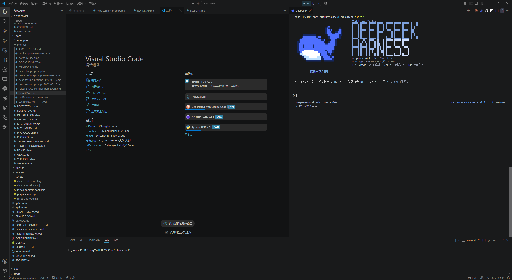
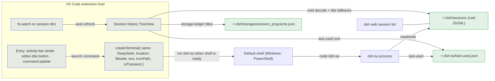

<!-- BEAUTIFIED -->
<h1 align="center">dsh-tui-vscode</h1>

<p align="center">
  <strong>VS Code companion extension for dsh-TUI — an experience almost identical to the official Claude Code VS Code extension</strong>
  <br />
  <em>Real integrated terminal · Beside placement · multiple concurrent sessions · sidebar session history · specific-session resume</em>
</p>

<p align="center">
  <a href="#quick-start"></a>
  <a href="LICENSE"></a>
</p>

<p align="center">
  
  
  
  
</p>

<p align="center">
  <a href="README_ZH.md">简体中文</a>
</p>

---

# dsh-tui-vscode

**dsh-tui-vscode** runs [`dsh-tui`](https://github.com/ccch1mneyyy/dsh-TUI) inside a REAL VS Code integrated terminal (a new editor column beside the active one; default shell — PowerShell on Windows) — **the same shape as the terminal mode of the official Claude Code VS Code extension** (`createTerminal` + run the CLI inside it), with no webview and no xterm emulation.

## Screenshot

Click the whale button and a **DeepSeek** terminal opens on the Beside column, running dsh-tui automatically — a real terminal, a real shell, the full TUI:

<p align="center">
  
</p>

## Features

- **Real terminal, not an emulation**: sessions run in the VS Code integrated terminal (your default shell) with everything native — shell integration, real Ctrl+C, copy/paste, fonts and theme.
- **Beside placement (default)**: `ViewColumn.Beside` — a NEW column beside the active one, never taking over the column you are looking at (same as Claude Code); `dsh-tui-vscode.terminalLocation` can switch to the current column (`active`) or the bottom panel (`panel`).
- **Multiple concurrent sessions**: every "Start new session" click opens a new terminal + session; older sessions keep running (same as Claude Code).
- **Sidebar session history**: shows only sessions of the **current VS Code workspace** (including sessions launched from its subdirectories; union over multi-root workspaces; empty list when no workspace is open), hiding boot-only sessions with no conversation, delegated sub-agent runs and **archived sessions** (same source as the dsh web list: the archive set in `storages/workspace.json`) — matching the dsh browser's default view; title + compact relative time (shared with the web session list); clicking an entry resumes THAT session; hover an entry to **archive** (dsh-native archiving: log retained, restorable anytime) or **rename**, right-click to **permanently delete** (destructive, kept behind the context menu); the "Manage archived sessions" command restores or permanently deletes; auto-refreshes on directory changes.
- **One-click start / resume**: `Start new session`, `Resume last session`, and specific-session resume from the sidebar — the latter goes through the `DSH_TUI_RESUME_SESSION` environment channel (read at boot by the profile's `cordis.patch.yml`), which does not interfere with `--resume`.
- **Auto start/stop + env injection**: open = start, closing the terminal ends the process; `$VISUAL` / `DSH_TUI_LANG` / `$DSH_HOME` are injected into the terminal environment.

## Quick Start

Prerequisites: install the DSH CLI and dsh-tui globally (the first run bootstraps the profile; pnpm required). Running models needs `DEEPSEEK_API_KEY`:

```sh
npm install -g @deepseek-ai/dsh @deepseek-harness-tui/dsh-tui
```

Install from the **VS Code extension marketplace** (recommended): press `Ctrl+Shift+X`, search for **`dsh-tui`** and install with one click; or build from source:

```sh
git clone https://github.com/baobaolaodie/dsh-tui-vscode.git
cd dsh-tui-vscode
npm install
npm run install:local
```

## Usage

- **Start / open more**: click the **editor-title whale button**, or run `dsh-tui: Start new session / 启动新会话` — every click opens a NEW **DeepSeek** terminal on the Beside column and runs dsh-tui automatically; click again for another concurrent session. The **activity-bar whale icon** opens the sidebar session history (its welcome view offers start/resume buttons).
- **Resume the last session**: `dsh-tui: Resume last session / 恢复上次会话` (`--resume`, reads `~/.dsh-tui/resume.txt`).
- **Resume a specific session**: in the sidebar session history, expand a project and click a session — a new terminal boots it with `DSH_TUI_RESUME_SESSION=<id>` in its environment.
- **Stop**: close the terminal tab (ends only that session), or double `Ctrl+C` inside the TUI; `dsh-tui: Terminate session / 终止会话` sends Ctrl+C to the most recent terminal.
- **Reference selected code**: with editor focus, press `Ctrl+Alt+K` (macOS `Cmd+Alt+K`), or use the Command Palette / editor context menu "Insert @-mention" — it inserts the current file or selection as **`@relative/path#Lstart-end`** into the running dsh-tui input box (relativized against the workspace root; single line `#L12`, multi-line `#L12-14`, bare relative path when nothing is selected; dsh-TUI natively slices the attachment to the line range at submit time instead of loading the whole file). With no running session it falls back to copying to the clipboard.
  > ⚠️ **Version gate**: the `#L` line-range syntax requires **dsh-TUI ≥ 0.9.1** ([upstream PR #537](https://github.com/ccch1mneyyy/dsh-TUI/pull/537), released in v0.9.1 on 2026-08-25); against an older dsh-TUI, `@` mentions report the file as missing — upgrade dsh-TUI first.
  - **Keybinding conflicts**: the default `Ctrl+Alt+K` (macOS `Cmd+Alt+K`) may collide with extensions like opencode (the official terminal mode uses the same default). If it does not work or conflicts, open "Keyboard Shortcuts" (`Ctrl+K Ctrl+S`), search `dsh_tui`, and rebind it to your preferred keys; the context-menu / command-palette entries are unaffected.
- **Automatic selection context (on by default)**: editor selections are pushed in real time to the running dsh-tui over the **IDE selection channel** (300 ms debounce, coordinates plus the editor's selection text, never touching the input box); asking a question automatically attaches the selected content and shows a "⧉ Selected N lines from …" indicator line; when the channel is unavailable it falls back to typing `@relative/path#L…`. Requires **dsh-TUI ≥ 0.11.0** — the IDE selection channel ([upstream PR #562](https://github.com/ccch1mneyyy/dsh-TUI/pull/562), released in v0.11.0 on 2026-09-24).

## Architecture


```mermaid
flowchart LR
  classDef ext fill:#4D6BFE22,stroke:#4D6BFE
  classDef data fill:#2ea04322,stroke:#2ea043

  subgraph host["VS Code extension host"]
    CMD["Entry: activity-bar whale · editor-title button · command palette"]:::ext
    TERM["createTerminal{ name: DeepSeek, location: Beside, env, iconPath, isTransient }"]:::ext
    SESS["Session history TreeView"]:::ext
    WATCH["fs.watch on session dirs"]:::ext
  end

  CMD -->|launch command| TERM
  TERM -->|run dsh-tui when shell is ready| SHELL["Default shell (Windows: PowerShell)"]
  SHELL -->|node dsh-tui| TUI["dsh-tui process"]
  TUI -->|read/write| STORE["~/.dsh/sessions (zstd JSONL)"]:::data
  TUI -->|last-used| MRU["~/.dsh-tui/last-used.json"]:::data
  WEB["dsh web session list"] --- STORE
  SESS -->|zstd decode + title fallbacks| STORE
  SESS -->|storage-ledger titles| CACHE["~/.dsh/storages/session_projcache.json"]:::data
  SESS -->|last-used sort| MRU
  WATCH -->|auto refresh| SESS
```

Key points:

- **Session = real terminal**: the extension only calls `createTerminal` and sends the launch command — process, signals, scrollback, copy/paste are all handled by the VS Code terminal (the same architecture as the official extension).
- **Specific-session resume**: the profile's `cordis.patch.yml` reads `DSH_TUI_RESUME_SESSION` at boot; `--resume` is deliberately NOT passed (the launcher would overwrite the env from `~/.dsh-tui/resume.txt` — verified in `bin/dsh-tui.js`).
- **Session-history data sources**: session logs (concatenated multi-frame zstd, **bounded window reads**: 64 KB head + 128 KB tail, decoded frame by frame, tolerantly) → title from log `session/title` event → dsh-storage ledger (the web list's own source) → first human prompt (incl. `agent/inbox/spliced`) → working-directory basename; the view is filtered to the current workspace with empty sessions, sub-agent runs and archived sessions hidden; within a group, sorted by last-used.
- **IDE selection channel**: on activation the extension starts a loopback WebSocket server on a random `127.0.0.1` port and writes a lock file (`~/.dsh-tui/ide/<port>.lock`: `{port, token, workspaceFolders, pid}`); terminals it spawns connect directly via the `DSH_TUI_IDE_PORT` / `DSH_TUI_IDE_TOKEN` environment variables (env-direct first), while manually launched dsh-tui instances discover it by scanning the lock directory matched against the workspace (lock-scan fallback). Selection changes are debounced 300 ms and pushed as `selection_changed` notifications carrying **coordinates and the editor's selection text** (0-based `{path, startLine, endLine, isEmpty, text, documentVersion}`; `text` includes unsaved edits), which dsh-TUI attaches verbatim. The handshake is protocol v2 (`ide/hello` → `ide/hello_ack`; a token or version mismatch is refused), loopback only, silent degradation on startup failure, lock cleared on deactivation. Requires **dsh-TUI ≥ 0.11.0** — the IDE selection channel ([upstream PR #562](https://github.com/ccch1mneyyy/dsh-TUI/pull/562), released in v0.11.0 on 2026-09-24).

## Configuration

| Key | Default | Description |
| --- | --- | --- |
| `dsh-tui-vscode.command` | `dsh-tui` | Launch command (resolved to an absolute path against the HOST PATH before being sent) |
| `dsh-tui-vscode.extraArgs` | `[]` | Extra CLI args, e.g. `["--lang","en"]` |
| `dsh-tui-vscode.terminalLocation` | `editor` | Terminal placement: `editor` (new editor-area column) / `active` (current column) / `panel` (bottom panel) |
| `dsh-tui-vscode.lang` | `""` | `""`/`zh`/`en`, exported as `DSH_TUI_LANG` |
| `dsh-tui-vscode.imageProtocol` | `sixel` | What to export as `DSH_TUI_IMAGE_PROTOCOL`: `sixel` (real raster images — needs `terminal.integrated.enableImages` to be `true` **with the window reloaded** and `terminal.integrated.gpuAcceleration` left at `auto`/`on`; degrades to half-block character art otherwise), `none` (always half-block character art), `auto` (removes the variable from the session environment and lets dsh-TUI decide). Requires **dsh-TUI ≥ 0.10.0**. See [Terminal images](#terminal-images). |
| `dsh-tui-vscode.injectEditor` | `true` | Export `$VISUAL` when unset |
| `dsh-tui-vscode.editorCommand` | `code -w` | Value exported as `$VISUAL` |
| `dsh-tui-vscode.dshHome` | `""` | `$DSH_HOME` override (empty = inherit) |
| `dsh-tui-vscode.autoInsertMention` | `true` | On selection change, push the selected code to the running dsh-TUI over the IDE selection channel (300 ms debounce; coordinates plus the editor's selection text, no input-box takeover; dsh-TUI attaches the content verbatim at submit and shows an indicator line). Requires **dsh-TUI ≥ 0.11.0** (IDE selection channel, [upstream PR #562](https://github.com/ccch1mneyyy/dsh-TUI/pull/562)); falls back to typing `@relative/path#Lstart-end` when the channel is unavailable. |

## Terminal images

The mascot artwork, chat photo thumbnails and image previews render as real raster images only when every condition below is met:

1. **VS Code side**: `terminal.integrated.enableImages` must be `true` (VS Code defaults to `false`), and you must **reload the window** after changing it — VS Code loads the `@xterm/addon-image` renderer only while it builds the WebGL renderer, so the setting does nothing until the window is reloaded. When a session starts with that setting off, the extension shows a one-time prompt with an "enable and reload" action and never writes your VS Code settings without asking. A failed settings write is the one deliberate exception to that "once": nothing was written, so the next session start offers the one-click path again. A write that *is* accepted but has no effect counts as that same failure — `terminal.integrated.enableImages` has window scope, so a workspace or folder override outranks the Global value the extension writes. The extension therefore inspects what each scope explicitly sets (`Configuration.inspect()`) **before** writing: an explicit `false` in the workspace or folder scope defeats the Global write, so nothing is written and the manual instructions appear instead of a reload offer. The verdict deliberately never re-reads the setting after writing — `update()` resolves before the new value reaches the extension host, so a read taken there can still see the old value and turn a successful click into a false failure. The prompt is not marked as answered on the manual path. That retry is guaranteed by the window's own state rather than by the persisted marker: clearing the marker is fire-and-forget, so a delayed or rejected clear cannot silence the promise the failure just made.
2. **Renderer side**: `terminal.integrated.gpuAcceleration` must leave the WebGL renderer possible. VS Code's own definition of `enableImages` says it "will only work when `terminal.integrated.gpuAcceleration` is enabled", and the image addon is attached to the WebGL renderer alone — so leave `gpuAcceleration` at `auto` (the default) or set it to `on`. With `off` (or the legacy `canvas` renderer value) the addon is never loaded, and the extension therefore exports `none` for every session in that window and stays silent: neither enabling `enableImages` nor reloading the window can bring the addon back.
3. **dsh-TUI side**: the extension exports `DSH_TUI_IMAGE_PROTOCOL`, which dsh-TUI has understood since **0.10.0** (checked release by release against `lib/types/ink/ink.js` for 0.10.0–0.13.0; absent in 0.9.0/0.9.1). An older dsh-TUI simply ignores the variable — harmless, but nothing changes either.

Because VS Code only builds that renderer while it loads a window, the extension judges this capability from two observations rather than the bare setting: the `terminal.integrated.enableImages` value it saw **when the window started** (snapshotted once at activation and deliberately not refreshed inside that window) **and** the live value — a session is given `sixel` only while both are `true`. A value written but not yet reloaded into this window — whether it came from the "Enable and Reload Window" action or from your own `settings.json` edit — therefore still exports `none` for every session started in that window, keeping the half-block character art visible instead of leaving a permanently blank image slot. That state is no longer silent: a one-time prompt ("Image rendering is enabled, but the setting takes effect only after a window reload", with a **Reload Window** button) says which step is still missing; only sessions started after the reload get `sixel`.

**Residual risk, not claimed as solved**: VS Code exposes no API that reports which renderer is actually in use. `auto` can still resolve to the canvas renderer on a machine without a usable GPU (the gate allows `sixel` there), and a `gpuAcceleration` change made mid-window is only re-read after the reload that restarts the extension host. In those cases the visible half-block character art — not this gate — is what keeps the image area from going blank.

`dsh-tui-vscode.imageProtocol` (default `sixel`) decides what gets exported:

| Value | Exported | Behavior |
| --- | --- | --- |
| `sixel` | `sixel` | Real raster images while terminal image rendering is on; with `enableImages` set to `false`, the default degrades to half-block character art, so the image area stays visible instead of going blank. |
| `none` | `none` | Always half-block character art, even when rendering is on. The extension also skips the setup prompt for this choice: a user who asked for character art is never nagged to enable images, and the one-time prompt is not consumed by an offer they did not want. |
| `auto` | *(removed)* | **Remove** `DSH_TUI_IMAGE_PROTOCOL` from the session environment and let dsh-TUI decide on its own — the opt-out path for when upstream protocol detection is fixed. Merely not writing the key would not be enough: VS Code overlays this env onto the environment the terminal would inherit, so a value exported by your own shell profile (or inherited from the VS Code process) would still reach dsh-tui and silently pin that protocol. |

**Verified combination**: Windows 11 (10.0.26200) + VS Code 1.140.0 + dsh-TUI 0.13.0. Other platforms, remote setups and other VS Code versions are **unverified**; the character-art fallback keeps the worst case visible rather than blank.

## UI language

The extension UI follows the **VS Code display language** (`vscode.env.language`): command-palette titles, view names, setting descriptions and runtime messages are localized through the standard `package.nls*.json` + `vscode.l10n` pipeline, with English as the default and an automatic fallback.

For a **Chinese UI**, install the **Chinese (Simplified) Language Pack** and restart VS Code — the pack is registered on first launch and takes effect after the restart (standard VS Code behavior; verified in our e2e).

This is separate from `dsh-tui-vscode.lang`, which only sets the **TUI's own** language through `DSH_TUI_LANG`; it does not translate the extension UI.

## Directory Structure

```
dsh-tui-vscode/
├── src/
│   ├── extension.ts        # Activation: command registration, createTerminal, views
│   ├── session.ts          # Env injection + launch-command resolution (host PATH)
│   ├── sessions.ts         # Session data layer (multi-frame zstd decode + bounded window reads + storage ledger + workspace filter + rename/delete + MRU sort)
│   ├── sessions-view.ts    # Sidebar session history (current workspace, empty/subagent hidden + fs.watch refresh)
│   ├── status.ts           # Status-bar item
│   ├── test/               # Data-layer unit tests (node:test)
│   └── test-suite/         # Real extension-host e2e (@vscode/test-electron)
├── media/icon.svg          # DeepSeek whale icon (activity bar / terminal tab)
├── media/icon.png          # Marketplace icon
├── scripts/
│   ├── install-commit-hook.mjs  # local hook installer
│   └── install-local.mjs        # installs the locally packaged vsix (version read from package.json)
├── .githooks/              # pre-commit / commit-msg (shipped in the repo)
├── .github/
│   ├── workflows/ci.yml    # full CI (test matrix/e2e/quality/pr-policy/release-consistency/security-scan/docs-links)
│   ├── PULL_REQUEST_TEMPLATE.md
│   └── ISSUE_TEMPLATE/     # four issue forms
├── CONTRIBUTING.md / CONTRIBUTING_ZH.md
├── SECURITY.md / SECURITY_ZH.md
├── CODE_OF_CONDUCT.md / CODE_OF_CONDUCT_ZH.md
├── CHANGELOG.md / CHANGELOG_ZH.md
├── README_ZH.md
├── package.json
└── LICENSE
```

## Tech Stack

| Layer | Technology |
| --- | --- |
| Language | TypeScript 5.6 (ESM syntax in source, compiled to CommonJS; Node 24 dev runtime) |
| Platform | VS Code Extension API (engines `^1.90.0`) |
| Runtime dependency | `@bokuweb/zstd-wasm` (session-log zstd decompression — the only dependency) |
| Testing | `node:test` unit tests + `@vscode/test-electron` real extension-host e2e |
| Packaging | `@vscode/vsce` |
| CI | GitHub Actions (Linux/Windows matrix + xvfb) |

## CI / Verification

`.github/workflows/ci.yml` runs on every push/PR: the **test job** (Linux/Windows × Node 22/24 matrix: `npm ci` → `typecheck` → `npm test`) and the **e2e job** (Linux + xvfb: `npm ci` → `npm run test:e2e` → `npm run package`).
Additional jobs: quality (bilingual mirror symmetry / BOM guard / actionlint), pr-policy (Conventional Commits title, branch prefix, PR template completeness, CHANGELOG self-check honesty), release-consistency (five-point version sync + per-version PR links), security-scan (credential scan) and docs-links (dead-link check).

The e2e suite covers: command registration, real terminal creation with env injection, input round-trip, multiple sessions, Ctrl+C termination, `--resume` resume, specific-session resume (env channel, no `--resume`), and a guarded REAL dsh-tui resume test (a successful resume creates no new session — observable).

## Contributing

See [CONTRIBUTING.md](CONTRIBUTING.md) — branch prefixes, Conventional Commits, the PR template and verification requirements are enforced by CI.

## License

MIT © 2026 baobaolaodie. dsh-tui itself is [ccch1mneyyy/dsh-TUI](https://github.com/ccch1mneyyy/dsh-TUI) (MIT).
