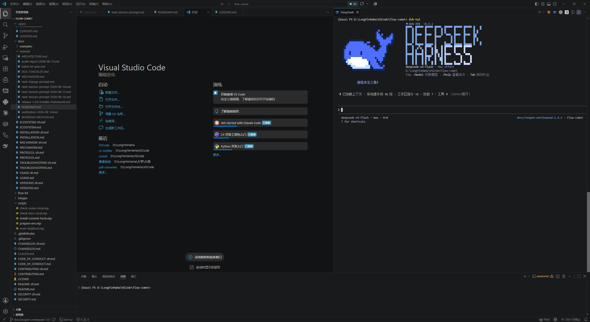
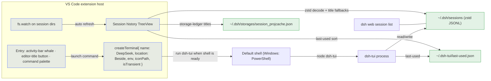

<!-- BEAUTIFIED -->
<h1 align="center">dsh-tui-vscode</h1>

<p align="center">
  <strong>VS Code companion extension for dsh-TUI — an experience almost identical to the official Claude Code VS Code extension</strong>
  <br />
  <em>Real integrated terminal · Beside placement · multiple concurrent sessions · sidebar session history · specific-session resume</em>
</p>

<p align="center">
  <a href="#quick-start"></a>
  <a href="LICENSE"></a>
</p>

<p align="center">
  
  
  
  
</p>

<p align="center">
  <a href="README.md">中文</a>
</p>

---

# dsh-tui-vscode

**dsh-tui-vscode** runs [`dsh-tui`](https://github.com/ccch1mneyyy/dsh-TUI) inside a REAL VS Code integrated terminal (a new editor column beside the active one; default shell — PowerShell on Windows) — **the same shape as the terminal mode of the official Claude Code VS Code extension** (`createTerminal` + run the CLI inside it), with no webview and no xterm emulation.
This is the implementation of [ccch1mneyyy/dsh-TUI#161](https://github.com/ccch1mneyyy/dsh-TUI/issues/161).

## Screenshot

Click the whale button and a **DeepSeek** terminal opens on the Beside column, running dsh-tui automatically — a real terminal, a real shell, the full TUI:

<p align="center">
  
</p>

## Features

- **Real terminal, not an emulation**: sessions run in the VS Code integrated terminal (your default shell) with everything native — shell integration, real Ctrl+C, copy/paste, fonts and theme.
- **Beside placement**: `ViewColumn.Beside` — a NEW column beside the active one, never taking over the column you are looking at (same as Claude Code).
- **Multiple concurrent sessions**: every "Start new session" click opens a new terminal + session; older sessions keep running (same as Claude Code).
- **Sidebar session history**: shows only sessions of the **current VS Code workspace** (including sessions launched from its subdirectories; union over multi-root workspaces; empty list when no workspace is open), hiding boot-only sessions with no conversation, delegated sub-agent runs and **archived sessions** (same source as the dsh web list: the archive set in `storages/workspace.json`) — matching the dsh browser's default view; title + compact relative time (shared with the web session list); clicking an entry resumes THAT session; hover an entry to **archive** (dsh-native archiving: log retained, restorable anytime) or **rename**, right-click to **permanently delete** (destructive, kept behind the context menu); the "Manage archived sessions" command restores or permanently deletes; auto-refreshes on directory changes.
- **One-click start / resume**: `Start new session`, `Resume last session`, and specific-session resume from the sidebar — the latter goes through the `DSH_TUI_RESUME_SESSION` environment channel (read at boot by the profile's `cordis.patch.yml`), which does not interfere with `--resume`.
- **Auto start/stop + env injection**: open = start, closing the terminal ends the process; `$VISUAL` / `DSH_TUI_LANG` / `$DSH_HOME` are injected into the terminal environment.

## Quick Start

Prerequisites: install the DSH CLI and dsh-tui globally (the first run bootstraps the profile; pnpm required). Running models needs `DEEPSEEK_API_KEY`:

```sh
npm install -g @deepseek-ai/dsh @deepseek-harness-tui/dsh-tui
```

Install from the **VS Code extension marketplace** (recommended): press `Ctrl+Shift+X`, search for **`dsh-tui`** and install with one click; or build from source:

```sh
git clone https://github.com/baobaolaodie/dsh-tui-vscode.git
cd dsh-tui-vscode
npm install
npm run install:local
```

## Usage

- **Start / open more**: click the **editor-title whale button**, or run `dsh-tui: Start new session / 启动新会话` — every click opens a NEW **DeepSeek** terminal on the Beside column and runs dsh-tui automatically; click again for another concurrent session. The **activity-bar whale icon** opens the sidebar session history (its welcome view offers start/resume buttons).
- **Resume the last session**: `dsh-tui: Resume last session / 恢复上次会话` (`--resume`, reads `~/.dsh-tui/resume.txt`).
- **Resume a specific session**: in the sidebar session history, expand a project and click a session — a new terminal boots it with `DSH_TUI_RESUME_SESSION=<id>` in its environment.
- **Stop**: close the terminal tab (ends only that session), or double `Ctrl+C` inside the TUI; `dsh-tui: Terminate session / 终止会话` sends Ctrl+C to the most recent terminal.

## Architecture



Key points:

- **Session = real terminal**: the extension only calls `createTerminal` and sends the launch command — process, signals, scrollback, copy/paste are all handled by the VS Code terminal (the same architecture as the official extension).
- **Specific-session resume**: the profile's `cordis.patch.yml` reads `DSH_TUI_RESUME_SESSION` at boot; `--resume` is deliberately NOT passed (the launcher would overwrite the env from `~/.dsh-tui/resume.txt` — verified in `bin/dsh-tui.js`).
- **Session-history data sources**: session logs (concatenated multi-frame zstd, **bounded window reads**: 64 KB head + 128 KB tail, decoded frame by frame, tolerantly) → title from log `session/title` event → dsh-storage ledger (the web list's own source) → first human prompt (incl. `agent/inbox/spliced`) → working-directory basename; the view is filtered to the current workspace with empty sessions, sub-agent runs and archived sessions hidden; within a group, sorted by last-used.

## Configuration

| Key | Default | Description |
| --- | --- | --- |
| `dsh-tui-vscode.command` | `dsh-tui` | Launch command (resolved to an absolute path against the HOST PATH before being sent) |
| `dsh-tui-vscode.extraArgs` | `[]` | Extra CLI args, e.g. `["--lang","en"]` |
| `dsh-tui-vscode.lang` | `""` | `""`/`zh`/`en`, exported as `DSH_TUI_LANG` |
| `dsh-tui-vscode.injectEditor` | `true` | Export `$VISUAL` when unset |
| `dsh-tui-vscode.editorCommand` | `code -w` | Value exported as `$VISUAL` |
| `dsh-tui-vscode.dshHome` | `""` | `$DSH_HOME` override (empty = inherit) |

## Directory Structure

```
dsh-tui-vscode/
├── src/
│   ├── extension.ts        # Activation: command registration, createTerminal, views
│   ├── session.ts          # Env injection + launch-command resolution (host PATH)
│   ├── sessions.ts         # Session data layer (multi-frame zstd decode + bounded window reads + storage ledger + workspace filter + rename/delete + MRU sort)
│   ├── sessions-view.ts    # Sidebar session history (current workspace, empty/subagent hidden + fs.watch refresh)
│   ├── status.ts           # Status-bar item
│   ├── test/               # Data-layer unit tests (node:test)
│   └── test-suite/         # Real extension-host e2e (@vscode/test-electron)
├── media/icon.svg          # DeepSeek whale icon (activity bar / terminal tab)
├── media/icon.png          # Marketplace icon
├── scripts/
│   ├── install-commit-hook.mjs  # local hook installer
│   └── install-local.mjs        # installs the locally packaged vsix (version read from package.json)
├── .githooks/              # pre-commit / commit-msg (shipped in the repo)
├── .github/
│   ├── workflows/ci.yml    # full CI (test matrix/e2e/quality/pr-policy/release-consistency/security-scan/docs-links)
│   ├── PULL_REQUEST_TEMPLATE.md
│   └── ISSUE_TEMPLATE/     # four issue forms
├── CONTRIBUTING.md / CONTRIBUTING_EN.md
├── SECURITY.md / SECURITY_EN.md
├── CODE_OF_CONDUCT.md / CODE_OF_CONDUCT_EN.md
├── CHANGELOG.md / CHANGELOG_EN.md
├── README_EN.md
├── package.json
└── LICENSE
```

## Tech Stack

| Layer | Technology |
| --- | --- |
| Language | TypeScript 5.6 (ESM syntax in source, compiled to CommonJS; Node 24 dev runtime) |
| Platform | VS Code Extension API (engines `^1.90.0`) |
| Runtime dependency | `@bokuweb/zstd-wasm` (session-log zstd decompression — the only dependency) |
| Testing | `node:test` unit tests + `@vscode/test-electron` real extension-host e2e |
| Packaging | `@vscode/vsce` |
| CI | GitHub Actions (Linux/Windows matrix + xvfb) |

## CI / Verification

`.github/workflows/ci.yml` runs on every push/PR: the **test job** (Linux/Windows × Node 22/24 matrix: `npm ci` → `typecheck` → `npm test`) and the **e2e job** (Linux + xvfb: `npm ci` → `npm run test:e2e` → `npm run package`).
Additional jobs: quality (bilingual mirror symmetry / BOM guard / actionlint), pr-policy (Conventional Commits title, branch prefix, PR template completeness, CHANGELOG self-check honesty), release-consistency (five-point version sync + per-version PR links), security-scan (credential scan) and docs-links (dead-link check).

The e2e suite covers: command registration, real terminal creation with env injection, input round-trip, multiple sessions, Ctrl+C termination, `--resume` resume, specific-session resume (env channel, no `--resume`), and a guarded REAL dsh-tui resume test (a successful resume creates no new session — observable).

## Contributing

See [CONTRIBUTING_EN.md](CONTRIBUTING_EN.md) — branch prefixes, Conventional Commits, the PR template and verification requirements are enforced by CI.

## License

MIT © 2026 baobaolaodie. dsh-tui itself is [ccch1mneyyy/dsh-TUI](https://github.com/ccch1mneyyy/dsh-TUI) (MIT).
